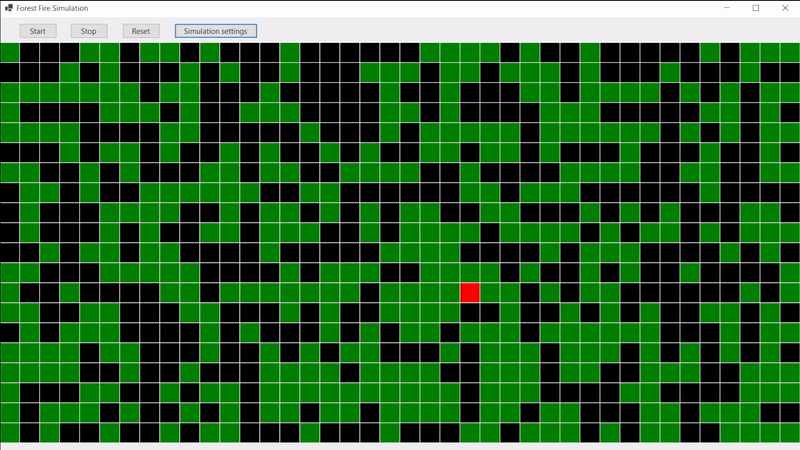
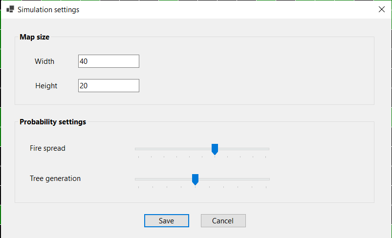

# Fire Spread Simulation
This project demonstrates a forest fire simulation based on a cellular automaton model. The simulation visualizes how fire spreads through a grid of cells representing trees, following predefined rules. The project is built in .NET with a graphical user interface using Windows Forms.

## Features
- **Cellular Automaton Model**: Simulates fire spread using a grid-based model.
- **Dynamic Visualization**: Displays the fire spreading process in real-time.
- **Adjustable Parameters**:
  - Grid size
  - Fire spread probability
- **Simulation Control**:
  - Start and stop the simulation
  - Reset the grid
- **Scroll Support**: Allows navigation of large grids.
- **Performance Optimization**: Uses double buffering for smooth rendering.

## How it works
1. Each cell in the grid can be in one of three states:
   - **Tree (Green)**: A normal tree that can catch fire.
   - **Burning (Red)**: A tree currently on fire.
   - **Burned (Black)**: A tree that has already burned down.
2. Fire spreads according to the following rules:
   - A tree ignites if at least one of its neighboring cells is burning and a random probability check is passed.
   - A burning tree turns into a burned tree in the next step.
   - Burned trees remain unchanged.
3. The simulation ends when there are no more burning trees.
